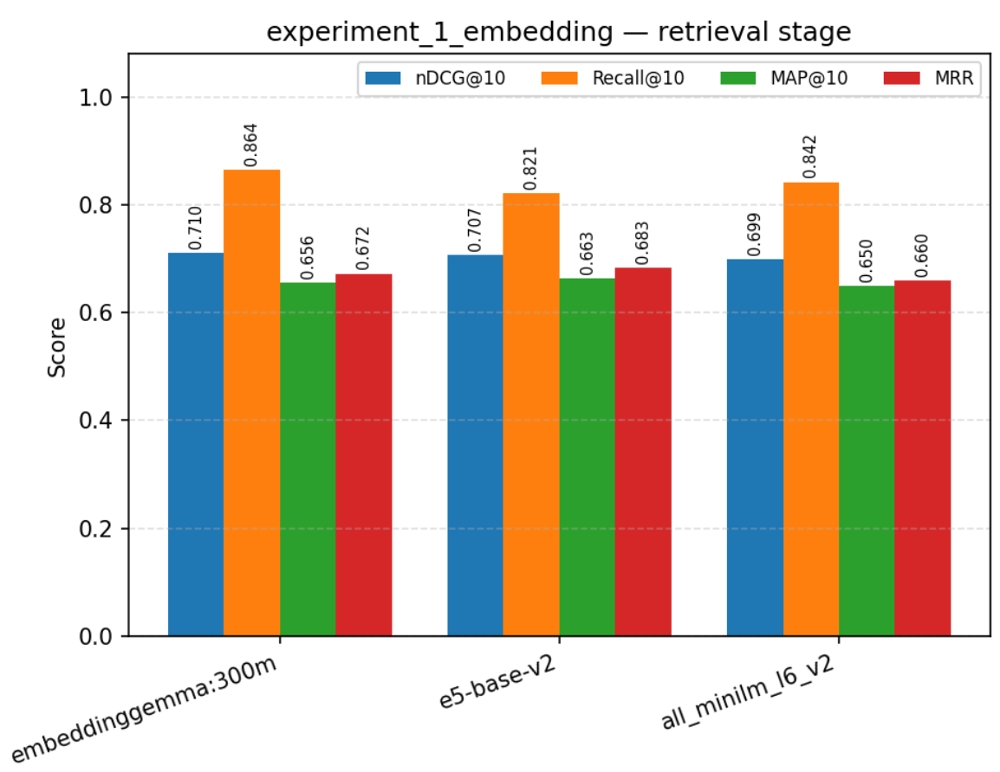

# RAG Experimentation Framework

> A modular, plugin-based framework for systematically building, evaluating, and comparing Retrieval-Augmented Generation (RAG) systems.

[](https://www.python.org/)
[](#plugin--registry-architecture)
[](#project-status)

## Overview

RAG systems are rarely improved by changing only one component. Chunking,
embeddings, retrieval, reranking, context construction, and generation all
affect the final answer.

This project provides a configurable experimentation framework where each
major RAG component can be replaced independently and evaluated against the
same dataset.

```text
Documents
   ↓
Chunking → Embedding → Vector Store
                         ↓
Query → Retrieval → Reranking → Context → Generation
              ↓           ↓
         Stage-level Evaluation → Experiment Sweeps → Leaderboard / Report
```


## Why this project?

A basic RAG pipeline can answer questions, but it is difficult to determine
*why* it succeeds or fails.

This framework is designed to answer questions such as:

- Which chunking strategy works best?
- Which embedding model gives the best retrieval?
- Does BM25 outperform dense retrieval?
- Does hybrid retrieval improve recall?
- Does reranking improve MRR or nDCG?
- Did retrieval fail, or did the LLM fail to use good context?
- Which complete RAG configuration performs best?

The goal is to make RAG experimentation **systematic, reproducible, and
configuration-driven**.

## Architecture

```text
                         ┌────────────────────┐
                         │     Documents      │
                         │ (CSV manifest/BEIR)│
                         └─────────┬──────────┘
                                   ↓
                         ┌────────────────────┐
                         │ Chunking Registry  │
                         └─────────┬──────────┘
                                   ↓
                         ┌────────────────────┐
                         │ Embedding Registry │
                         └─────────┬──────────┘
                                   ↓
                         ┌────────────────────┐
                         │ Vector Store       │
                         │ Registry           │
                         └─────────┬──────────┘
                                   ↓
                              OFFLINE INDEX
════════════════════════════════════════════════════════════
                              ONLINE RAG
                                   ↓
                                Query
                                   ↓
                         ┌────────────────────┐
                         │ Retriever Registry │
                         └─────────┬──────────┘
                                   ↓
                              Candidate Top-N
                                   ↓
                         ┌────────────────────┐
                         │ Reranker Registry  │
                         └─────────┬──────────┘
                                   ↓
                                  Top-K
                                   ↓
                         ┌────────────────────┐
                         │ Context Builder    │
                         │ Registry            │
                         └─────────┬──────────┘
                                   ↓
                         ┌────────────────────┐
                         │ Generator Registry │
                         └─────────┬──────────┘
                                   ↓
                            Answer + Sources
════════════════════════════════════════════════════════════
                         STAGE-LEVEL EVALUATION
                                   ↓
                    Retrieval metrics ─── Reranking metrics
                       (nDCG, Recall,       (+ rank movement
                        MAP, MRR,             vs. retrieval,
                        gold coverage)        n_tracked)
                                   ↓
                         ┌────────────────────┐
                         │ Experiment Runner  │
                         │ (config sweeps)    │
                         └─────────┬──────────┘
                                   ↓
                     Leaderboard + HTML report (charts)
```

## Current Features

- Modular offline indexing pipeline
- Configurable chunking strategies
- Embedding model registry
- FAISS and Qdrant vector-store support
- Dense retrieval
- BM25 retrieval
- Hybrid retrieval
- Identity and cross-encoder reranking
- Context builder with source preservation and character budget
- Generator registry
- Ollama generation

## Plugin / Registry Architecture

Each major component is independently registered:

```text
chunker_registry
embedding_registry
vector_store_registry
retriever_registry
reranker_registry
context_builder_registry
generator_registry
```

For example:

```text
retriever_registry
├── dense
├── bm25
└── hybrid
```

and:

```text
reranker_registry
├── identity
└── cross_encoder
```

A new implementation can be added without changing the main RAG pipeline.

Example:

```python
@retriever_registry.register("my_retriever")
class MyRetriever:
    ...
```

Then select it from YAML:

```yaml
retriever:
  type: my_retriever
```

This makes the framework suitable for controlled experiments.

## Repository Structure

```text
rag-experimentation-framework/
│
├── configs/
│   ├── rag_full_ollama.yaml
│   ├── rag_full_ollama_dense.yaml
│   └── evaluation_example.yaml
│
├── data/
│   └── evaluation/
│       └── example_dataset.json
│
├── scripts/
│   ├── rag.py
│   ├── evaluate.py
│   └── compare_experiments.py
│
├── src/
│   ├── chunking/
│   ├── embeddings/
│   ├── vectorstores/
│   ├── retrieval/
│   ├── reranking/
│   ├── context/
│   ├── generation/
│   ├── evaluation/
│   ├── pipeline/
│   └── plugins/
│       └── registry.py
│
|├── artifacts/
│   ├── eval/<experiment_name>/     # per-variant JSON results + report.html
│   └── experiments/<experiment_name>/<variant>/   # isolated per-variant indexes
|
├── tests/
├── artifacts/
└── README.md
```


## ⚙️ Setup & Installation

### Prerequisites
Make sure you have [Conda](https://docs.conda.io/projects/conda/en/latest/user-guide/install/index.html) (Anaconda or Miniconda) installed on your system.


### 1. Create and Activate Conda Environment

Create a new Conda environment:

```bash
# Create the environment
conda create -n rag-exp python=3.10 -y

# Activate the environment
conda activate rag-exp

```

### 3. Install Dependencies


```bash
pip install -r requirements.txt
```


## Ollama Setup

Pull the embedding model:

```bash
ollama pull nomic-embed-text
```

Pull the generation model:

```bash
ollama pull qwen3:4b
```

The models can be changed through YAML configuration.

## Run the RAG Pipeline

```bash
PYTHONPATH=. python scripts/rag.py \
  --config configs/rag_full_ollama.yaml \
  --query "How does sensor fusion improve obstacle detection?"
```

The complete online pipeline is:

```text
Query
 ↓
Hybrid Retrieval
 ↓
Candidate Top-N
 ↓
Cross Encoder
 ↓
Top-K
 ↓
Context Builder
 ↓
Ollama
 ↓
Answer + Sources
```

## Context Building

Retrieved chunks are converted into source-aware context:

```text
[Source 1 | chunk=abc123]
First relevant chunk...

---

[Source 2 | chunk=def456]
Second relevant chunk...
```

A context budget can be configured:

```yaml
context:
  type: simple
  params:
    max_characters: 12000
```

This keeps context construction independent from retrieval and generation.

## Generation

Generation uses a provider registry:

```text
generator_registry
└── ollama
```

Example:

```yaml
generation:
  provider: ollama
  params:
    model: qwen3:4b
    base_url: http://localhost:11434
    temperature: 0.0
```

The provider-independent interface makes future integrations possible without
rewriting the RAG pipeline.

## Evaluation Layer

`src/evaluation/` scores **retrieval and reranking independently** against
document-level relevance judgments (BEIR `qrels`), rather than only judging
the final generated answer — this is what makes it possible to tell "the
retriever missed the document" apart from "retrieval was fine, reranking
demoted it."

- **Metrics** (via `pytrec_eval`): nDCG@k, Recall@k, Precision@k, MAP@k, MRR
- **`gold_coverage`** — fraction of queries where a relevant document made it
  into the candidate pool at all (the recall ceiling any downstream stage
  could possibly hit)
- **`rank_movement`** — average change in rank position of gold documents
  between retrieval and reranking, with `n_tracked` (a `0.0` average with
  `n_tracked=0` means "nothing to compare," not "no movement" — always check
  `n_tracked` before reading `avg_rank_delta` at face value)
- Chunk-level results are deduplicated to document-level (best-ranked chunk
  per document wins) before scoring, so chunking strategies aren't
  penalized/rewarded purely for chunk count
- Retriever + reranker are instantiated **once** per evaluation run, not per
  query
- Results are saved as JSON and rendered into a self-contained **HTML
  report** (grouped bar charts per stage + leaderboard table, best variant
  highlighted) — opens directly in a browser, no server needed

```bash
python scripts/evaluate_retrieval.py
```

## Experiments

`src/experiments/` provides config-override infrastructure for sweeping one
pipeline axis at a time while holding everything else fixed, with isolated
artifacts per variant (so sweeping embeddings/chunking never overwrites a
previous variant's index).

| Script | Varies | Fixed | Reindexes? |
|---|---|---|---|
| `experiment_1_embeddings.py` | embedding model | baseline `fixed` chunking, everything else | every variant |
| `experiment_2_chunking.py` | chunking strategy/params | baseline embedding, everything else | every variant |
| `experiment_3_retrieval_methods.py` | retrieval type + reranker (dense / BM25 / hybrid / hybrid+reranker) | chunking, embedding, vector store | once, shared across all variants |

```bash
python scripts/experiment_1_embeddings.py
python scripts/experiment_2_chunking.py
python scripts/experiment_3_retrieval_methods.py
```

Each writes `artifacts/eval/<experiment_name>/report.html`.

### Results (SciFact, BEIR)

**Experiment 1 — embedding models** (baseline `fixed` chunking, hybrid retrieval, identity reranker)




| Model | Retrieval nDCG@10 | Retrieval Recall@10 | Retrieval MAP@10 | Retrieval MRR |
|---|---|---|---|---|
| **embeddinggemma:300m** | **0.710** | **0.864** | 0.656 | 0.672 |
| e5-base-v2 | 0.707 | 0.821 | **0.663** | **0.683** |
| all-MiniLM-L6-v2 | 0.699 | 0.842 | 0.650 | 0.660 |

This is a much closer race than it might look at first glance: `embeddinggemma:300m`
edges out the other two on nDCG@10 and clearly leads on Recall@10, but `e5-base-v2`
actually has the best MAP@10 and MRR. No single model dominates on every metric,
so which one to pick depends on whether you care more about getting *a* relevant
document highly ranked (MRR) or maximizing recall of the full relevant set.
Gold coverage wasn't captured in this run — see the Evaluation Layer section
above for what that metric would add if you want the full picture before
committing to one embedding model.

**Experiment 2 — chunking strategies** (baseline embedding, hybrid retrieval, identity reranker)


| Strategy | Retrieval nDCG@10 | Retrieval Recall@10 | Retrieval MAP@10 | Retrieval MRR |
|---|---|---|---|---|
| **sentence (1000, 1 overlap)** | **0.706** | **0.851** | **0.656** | 0.663 |
| recursive (1000/150) | 0.702 | 0.842 | 0.653 | **0.663** |
| fixed (500/50) | 0.692 | 0.823 | 0.647 | 0.656 |
| fixed (1000/150) | 0.677 | 0.836 | 0.622 | 0.632 |

Boundary-aware chunking (`sentence`, `recursive`) beats character-count
chunking (`fixed`) — expected for dense scientific prose where an arbitrary
cutoff is more likely to sever the exact sentence containing the claim.
Smaller fixed chunks also beat larger ones, consistent with SciFact's
short, single-claim abstracts.


**Experiment 3 — retrieval methods × reranking** (config.yaml baseline chunking/embedding; every variant evaluated at the same `reranker.top_k`, so retrieval-stage and reranking-stage numbers are directly comparable)

Retrieval stage — dense vs. BM25 vs. hybrid, before any reranking:


| Retriever | nDCG@10 | Recall@10 | MAP@10 | MRR |
|---|---|---|---|---|
| dense only | 0.673 | 0.818 | 0.622 | 0.633 |
| bm25 only | 0.637 | 0.761 | 0.591 | 0.607 |
| **hybrid only** | **0.706** | **0.848** | **0.657** | **0.667** |

Reranking stage — the same three retrievers, each with the cross-encoder reranker added on top:


| Retriever + reranker | nDCG@10 | Recall@10 | MAP@10 | MRR |
|---|---|---|---|---|
| dense + reranker | 0.717 | 0.836 | 0.673 | 0.684 |
| bm25 + reranker | 0.681 | 0.777 | 0.644 | 0.658 |
| **hybrid + reranker** | **0.721** | **0.852** | **0.674** | **0.687** |

Because every variant here shares the same `reranker.top_k` (no truncation
confound between stages — see the warning below), the retrieval-stage vs.
reranking-stage tables above are a fair before/after comparison for each
retriever individually:

| Retriever | nDCG@10 before → after reranking | Δ |
|---|---|---|
| dense | 0.673 → 0.717 | **+0.044** |
| bm25 | 0.637 → 0.681 | **+0.044** |
| hybrid | 0.706 → 0.721 | +0.015 |

The cross-encoder reranker helps every retriever, but the gain is largest for
dense and BM25 individually — hybrid retrieval already does much of that
work upfront by fusing both signals, so there's less room left for the
reranker to improve on it. Hybrid + reranker remains the best overall
configuration on every metric.


**Practical takeaway:** `sentence` chunking (Experiment 2) and hybrid
retrieval + cross-encoder reranker (Experiment 3) are each individually the
best choice on their axis; `embeddinggemma:300m` (Experiment 1) is the best
overall embedding model but by a narrower margin than a single metric would
suggest. Each experiment swept its axis from a different baseline, so the
full combination hasn't been validated together yet — worth its own
follow-up run.

## Roadmap

### Completed

### Completed

- [x] Modular offline indexing pipeline (CSV manifest + BEIR)
- [x] Chunking strategies
- [x] Embedding plugins
- [x] FAISS backend
- [x] Qdrant backend
- [x] Dense retrieval
- [x] BM25 retrieval
- [x] Hybrid retrieval
- [x] Reranking registry
- [x] Cross-encoder reranking
- [x] Context builder
- [x] Generation registry
- [x] Ollama generation
- [x] Evaluation dataset format (BEIR queries/qrels → `EvalExample`)
- [x] Retrieval metrics (nDCG, Recall, Precision, MAP, MRR via pytrec_eval)
- [x] Experiment runner (config-override sweeps, isolated per-variant artifacts)
- [x] Experiment comparison (N-way leaderboard, pairwise run diffs)
- [x] Stage-level retrieval vs. reranking evaluation (+ rank movement, gold coverage)
- [x] Visual HTML reports (grouped bar charts per stage)

### Planned

- [ ] Wire `semantic` chunker into config-driven creation (needs an `EmbeddingModel`-instance adapter)
- [ ] Context relevance metrics
- [ ] Faithfulness / groundedness evaluation
- [ ] Answer relevance evaluation
- [ ] LLM-as-a-judge
- [ ] Experiment tracking database
- [ ] Results dashboard
- [ ] Automatic hyperparameter sweeps
- [ ] Statistical significance testing
- [ ] More multilingual evaluation
- [ ] Arabic-specific RAG experiments

## Technology Stack

- Python
- Ollama
- FAISS
- Qdrant
- BM25
- Cross-Encoder reranking
- YAML configuration
- JSON evaluation datasets
- Plugin / Registry architecture

The framework is intentionally model- and backend-agnostic.

## Project Status

This is an experimental RAG engineering framework focused on:

- learning RAG deeply
- testing retrieval architectures
- benchmarking models
- understanding RAG failure modes
- prototyping RAG systems
- building reproducible experiments

It is not intended to be a production-ready RAG platform yet.

## Contributing

Contributions are welcome.

A useful contribution should ideally:

1. Use the registry architecture.
2. Include tests.
3. Keep configuration separate from implementation.
4. Document the new component.
5. Include an example experiment where appropriate.

## License

MIT License.

## Author

**Youssef Kamel**

